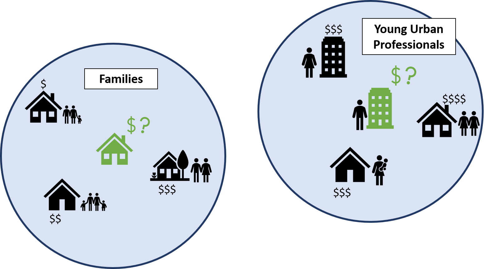
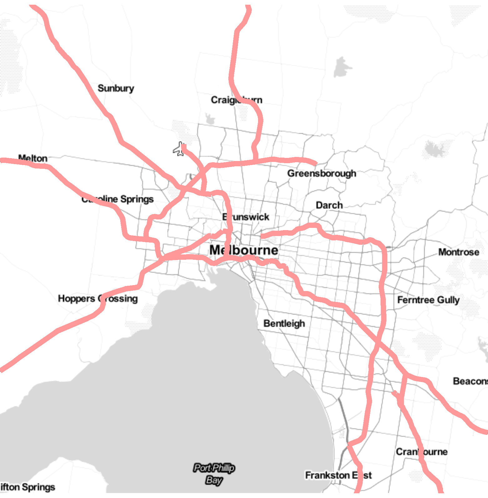
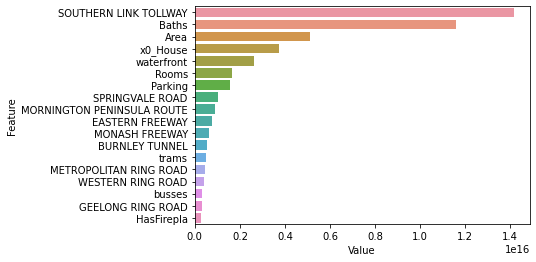

# Melbourne House Price Prediction Challenge
> Matteo Courthoud, Julian Teichgräber, Carlo Zanella, and Simon Zuzek

With this repository, we participated at the **ACE Datathon 2021** of the [Analytics Club at ETH](https://analytics-club.org/) in a machine learning challange sponsored by [Credit Suisse](https://credit-suisse.com) to predict house prices on a private dataset of the Melbourne Housing market. 

At the end of the 24-hour event, our final score on the private test data achieved a RMSE of 166730 and ranked us **second out of 13 teams** on the private leaderboard.   

The final ranking among the top 3 submissions was determined by a professional jury after each team pitched their approach. We were awarded **first place overall** for our modelling approach and score. 

Below, we walk you through aspects of our solution.

### Local preferences

The price of a house ultimately depends on the willingness of people to pay for it. With this in mind, it is important to realize that **different locations will attract customers with different preferences over housing charactersitics.** A single bedroom appartment with a rooftop terrace may sell for a high price if it is in a hip area, while the same property may be less desirable in a calm, family-oriented neighbourhood. 

There are many possible proxies for local preferences, depending on what we believe matters for customers - parks, schools, bars, etc. But the **best proxy for local preferences over real estate characterstics are prices and characteristics of nearby units.**

We therefore estimate many local models separately for small segments of the Melbourne housing market. For simplicit, we make use of the administrative neighbourhoods in the original dataset. For each of these, we estimate a model with all our features and inlude 10% of the entire dataset, weighted by distance.  

### Access to mobility

The main challenge of the competition was to identify further features in the public domain by using the precise geo-location of each transaction, with a particular focus on features which 
- are relevant for house prices in other settings and
- are feasible to generate in areas with less available data. 

We decided to focus on **access to mobility**, since we believe that connection public transport and major transit routes is an important determinant for the value of property in most settings.  

We used public data by the [City of Melbourne](https://data.melbourne.vic.gov.au/) to get the location of bus stops and the precise outline of major roads in the melbourne area. We then computed the distance to the nearest bus stop, as well as the distance to each of these roads as a feature for our model. Below, we investage the feature importance by the total gain that these features have achieved in our final GBM pipeline. 

Connection to the Souther Link Tollway proves to be very important, and even dominates standard predictors such as square meters ("Area") and number of baths. Some of the other state roads are also among the most important features, so is closeness to busses. 

An important takeaway of our approach is that important roads are easily observed and can be geo-coded from local maps with low effort in any setting. 

Melbourne - Major roads    |  Feature importance (total gain)
:-------------------------:|:-------------------------:
  |  

# Roadmap to the repository: 

[main.ipynb](main.ipynb) contains 
- our testing pipeline: a single LGBM model on which we select paramters with cross validation
- our *Local model*: separate LGBM models for each of the neighbourhoods, each trained on a distance-weighted subsample of the entire data.  

[feature_importance.ipynb](feature_importance.ipynb) contains a plot for the feature importance of our testing pipeline. We have not implemented a feature importance metric for our custom ensemble of local models.

The reminding notebooks generate various features and should be self-explanatory. 

**Please feel free to reach out to us if you have comments or questions.**

*Note:* 
The dataset of the competition is private. A publicly available related dataset can be found [here](https://www.kaggle.com/anthonypino/melbourne-housing-market).

